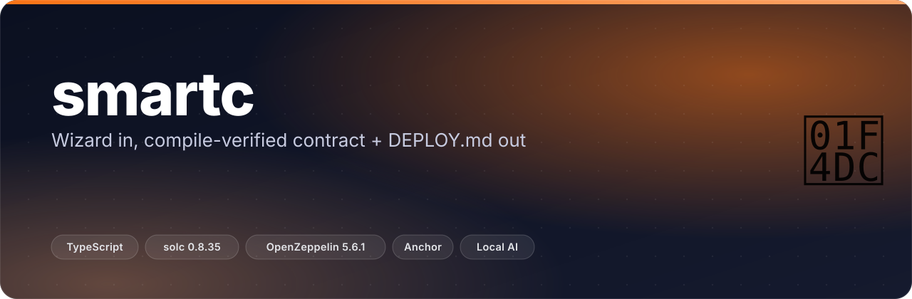
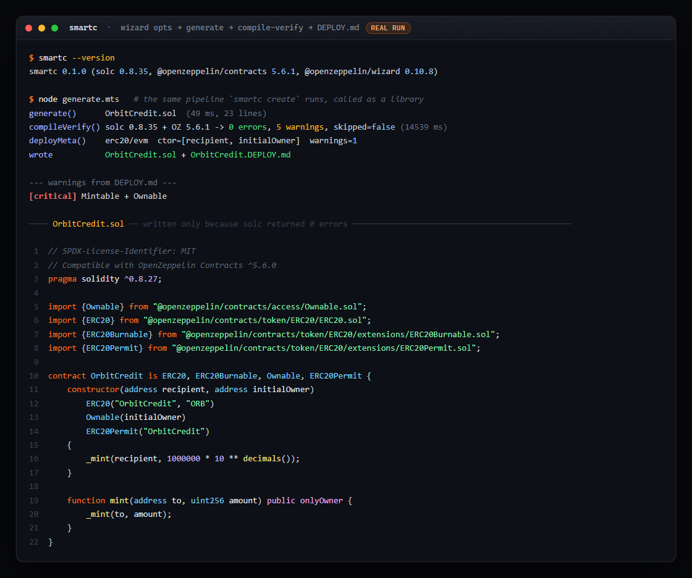
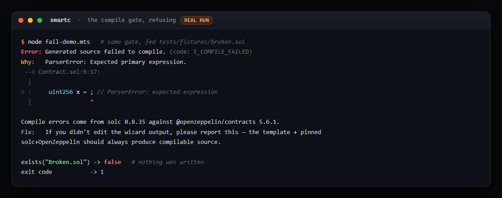
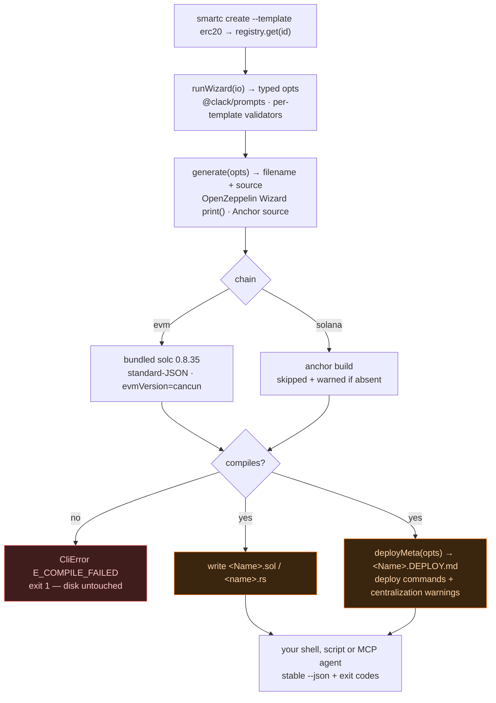
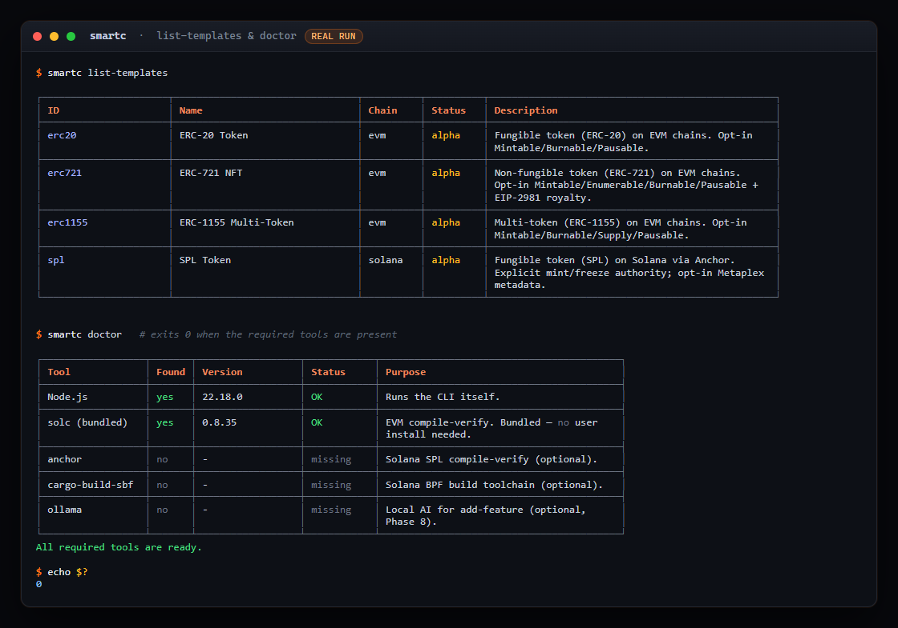

<p align="center"></p>

<p align="center">
  <b>Answer a few questions, get a smart contract that already compiles — and the DEPLOY.md that tells you how to ship it safely.</b>
</p>

<p align="center">
  <a href="https://github.com/ChinmayGit8765/SmartContract-Creator/actions/workflows/ci.yml"></a>
  <a href="https://www.npmjs.com/package/smartc"></a>
  <a href="https://nodejs.org">=20"></a>
  
  <a href="LICENSE"></a>
</p>

---

## ✨ What it does

- **Nothing un-compilable reaches disk.** Every Solidity file is compiled **in-process** against pinned `solc 0.8.35` + `@openzeppelin/contracts 5.6.1` *before* `writeFile` is called. Compile error → exit 1, empty directory.
- **4 templates, one wizard.** ERC-20, ERC-721 (NFT), ERC-1155 (multi-token) on EVM chains, and SPL tokens on Solana (Anchor).
- **A `DEPLOY.md` next to every contract.** Remix / Hardhat / Foundry / Etherscan for EVM, `spl-token` CLI + Anchor for Solana — with the constructor args pre-filled and centralization warnings derived from *your* option choices.
- **Optional local AI.** `add-feature` patches custom logic into an existing contract via a **local** Ollama model: diff preview, confirmation, then a sandbox-compile that rolls back anything that won't build. No cloud, no API keys.
- **Newbie or expert.** `--newbie` adds explanations and EIP/doc links; the default is terse. `--json` on the read-only commands is a stable machine contract, so scripts and MCP agents can drive it.
- **No toolchain homework.** `solc` and OpenZeppelin are bundled. Anchor and Ollama are optional — `smartc doctor` tells you exactly what you have.

## 🎬 See it

The wizard needs a TTY, so the run below drives the *same* pipeline as `smartc create` through the library surface documented in [docs/EMBEDDING.md](docs/EMBEDDING.md): supply the opts, `generate()`, `compileVerify()`, `deployMeta()`. Real output, real 14.5 s `solc` run, real files.


<sub>An Ownable + Mintable + Burnable ERC-20. <code>deployMeta()</code> flags the mint-authority footgun as <b>critical</b> in the generated <code>DEPLOY.md</code> — because you chose Ownable, not because a linter guessed.</sub>

And the part that matters — the gate actually refusing:


<sub>Fed <code>tests/fixtures/broken.sol</code>. You get solc's diagnostic verbatim, exit 1, and <code>exists("Broken.sol") -&gt; false</code>.</sub>

## 🧠 How it works



Four seams, deliberately boring:

1. **Registry** — a template is `{ id, name, chain, status, description }` plus optional `runWizard` / `generate` / `deployMeta`. Registration order is list order, so output is deterministic.
2. **Generate is pure.** For EVM it is a thin wrapper around `@openzeppelin/wizard`'s `print()` — no string templating, no sentinels — so the source is byte-identical to what [wizard.openzeppelin.com](https://wizard.openzeppelin.com) would give you.
3. **Compile-verify is the gate.** EVM goes through solc's standard-JSON API with an import callback that resolves `@openzeppelin/contracts` from the bundled copy, at `evmVersion: "cancun"` (OZ 5.6.1 uses the Cancun-only `mcopy` opcode — `paris` does not build). Solana shells out to `anchor build`, and when Anchor is missing it *skips with a loud warning* rather than lying.
4. **`DeployMeta` is chain-agnostic.** Each template maps its own opts onto one normalized descriptor; the deploy generator only ever sees that, which is why adding a chain does not touch the doc sections.

## 🚀 Quick start

Requires **Node.js 20+**.

```sh
npm install -g smartc
smartc create --template erc20 --out MyToken.sol
# walks the wizard, compile-verifies, writes MyToken.sol + MyToken.DEPLOY.md
```

Or without installing: `npx smartc create --template erc20`.

Prefer explanations? Add `--newbie`. Automating? Add `--force` to skip prompts. No need to install `solc` or OpenZeppelin — they're bundled; run `smartc doctor` to see what else you have.

<details>
<summary><b>Commands, flags and exit codes</b></summary>

| Command | What it does |
|---------|--------------|
| `smartc create --template <id>` | Run the wizard for a template and write `<Name>.<ext>` + `<Name>.DEPLOY.md`. |
| `smartc list-templates [--json]` | List available templates. |
| `smartc doctor [--json]` | Probe the toolchain (Node, bundled solc, anchor, cargo-build-sbf, ollama). Exit 0 when required tools are present. |
| `smartc add-feature --ai --file <path> "<description>"` | Patch a feature into an existing contract via local Ollama. |

Global flags: `--newbie` (explanations, env `SMARTC_NEWBIE=1`), `--verbose` (alias), `--force` (skip **all** confirmation prompts), `--no-color`, `--json` (machine output where supported), `-V`/`--version`.

Exit codes: `0` ok · `1` runtime error · `2` usage error · `130` cancelled. Every error carries a stable `code:` token (`E_COMPILE_FAILED`, `E_USAGE`, `E_FILE_EXISTS`, …) plus a three-part *what / why / fix* block. `list-templates --json` and `doctor --json` are stable machine contracts; `create` is interactive and refuses `--json`.



</details>

## 🧩 Templates

All four are driven by the same wizard. EVM output matches OpenZeppelin Wizard conventions byte-for-byte.

| id | Chain | Options you choose |
|----|-------|--------------------|
| `erc20` | evm | name, symbol, supply, opt-in Mintable/Burnable/Pausable, Ownable vs AccessControl |
| `erc721` | evm | name, symbol, base URI, opt-in Mintable/Enumerable/Burnable/Pausable, EIP-2981 royalties |
| `erc1155` | evm | URI template, opt-in Mintable/Burnable/Supply-tracking/Pausable |
| `spl` | solana | name, symbol, decimals, supply, **explicit** mint- and freeze-authority choices, opt-in Metaplex metadata |

`smartc create --template erc20` with a 1,000,000 premint and every extension declined writes exactly this — the byte-for-byte golden the test suite snapshots against:

```solidity
// SPDX-License-Identifier: MIT
// Compatible with OpenZeppelin Contracts ^5.6.0
pragma solidity ^0.8.27;

import {ERC20} from "@openzeppelin/contracts/token/ERC20/ERC20.sol";
import {ERC20Permit} from "@openzeppelin/contracts/token/ERC20/extensions/ERC20Permit.sol";

contract MyToken is ERC20, ERC20Permit {
    constructor(address recipient)
        ERC20("MyToken", "MTK")
        ERC20Permit("MyToken")
    {
        _mint(recipient, 1000000 * 10 ** decimals());
    }
}
```

The SPL template writes an Anchor program (`<name>.rs`) instead, and its `DEPLOY.md` covers both the `spl-token` CLI and the Anchor deploy paths for devnet and mainnet-beta.

Every `create` also writes a `DEPLOY.md` next to the contract. For an Ownable + Mintable ERC-20, that file includes, for example:

> **Mintable + Ownable (CRITICAL):** a single key can mint unlimited tokens. Consider AccessControl (multi-role) or transferring ownership to a multisig before deploy.

## 🤖 AI add-feature (optional, local)

```sh
smartc add-feature --ai --file MyToken.sol "add a per-wallet mint cap of 100 tokens"
```

Connects to a **local** [Ollama](https://ollama.com) daemon (no cloud, no keys), shows you a diff, asks you to confirm, then **sandbox-compiles** the result and only writes it if it builds. Default model `qwen2.5-coder` (override with `--model` or `SMARTC_OLLAMA_MODEL`). If Ollama isn't running, it tells you and points at `smartc doctor`.

> AI output is a suggestion, not an audit — always review and test before deploying value.

## 🛡️ Safety

`smartc` generates and compiles; **it never broadcasts a transaction.** The generated `DEPLOY.md` carries a pre-deploy checklist and surfaces the centralization risks specific to your options — who holds mint authority, whether one EOA controls everything, which constructor args are baked in forever. **Have contracts audited before they hold real value.**

## 🗂️ Project layout

```
src/
  cli.ts          entry: registers templates, dispatches, maps errors → exit codes
  program.ts      commander tree + global flags
  commands/       create · list-templates · doctor · add-feature
  registry/       id → Template { runWizard?, generate?, deployMeta? }, insertion-ordered
  templates/
    erc20/ erc721/ erc1155/   opts · wizard · validators · generate · deployMeta
    spl/                      Anchor program source + Rust naming rules
  compiler/       solc standard-JSON + OZ import callback · anchor-build adapter
  deploy/         DeployMeta → DEPLOY.md sections (remix/hardhat/foundry/etherscan · solana/*)
  ai/             Ollama client · prompt builder · diff renderer
  lib/            color · env · errors · output · prompt · version
tests/            41 spec files; fixtures/ holds golden .sol and .DEPLOY.md files
docs/             HOWTO · FORKING · EMBEDDING          scripts/  probe-compile.mjs
```

## 🧰 Stack

| Layer | Choice | Why |
|-------|--------|-----|
| CLI | `commander` 14 + `exitOverride()` | subcommand tree, global flags, and exact Unix exit codes (2 for usage, 130 for Ctrl-C) |
| Prompts | `@clack/prompts` | the wizard; cancel maps to a real exit code instead of a stack trace |
| Contract source | `@openzeppelin/wizard` 0.10.8 | audited output, byte-identical to the OZ Wizard site — no hand-rolled templating |
| Compile gate | bundled `solc` 0.8.35, standard-JSON, `evmVersion: cancun` | in-process verification with zero user install; Cancun because OZ 5.6.1 needs `mcopy` |
| Solana | `anchor build` (optional) | real verification when the toolchain exists, explicit skip-warning when it doesn't |
| AI | local Ollama, default `qwen2.5-coder` | patches stay on your machine; sandbox-compile gates every write |
| Build | `tsup` → one ESM `dist/cli.js` (~96 KB) | single-file binary entry, Node 20 target |
| Tests | `vitest` — 41 files, 374 passing | golden `.sol` / `.DEPLOY.md` fixtures catch any drift in generated output |

## 🗺️ Status & roadmap

Feature-complete for v1; templates are registered as `alpha` while the output settles.

- ✅ All 4 templates (ERC-20 / 721 / 1155 / SPL), wizard-parity with OpenZeppelin
- ✅ In-process compile-verify gate, `DEPLOY.md` generation, `doctor`, AI `add-feature`
- ✅ CI on ubuntu + windows + macOS × Node 20 & 22: typecheck, tests, build, and a global-install smoke test (`npm pack` → `npm i -g` → run)
- 🚧 EVM templates are fully compile-verified; the SPL template is compile-verified **only** when the Anchor toolchain is installed, and otherwise written with a clear "verification skipped" warning
- 🔜 Flag-driven non-interactive `create` (today `create` requires a TTY and refuses `--json`)

## 📚 Documentation

- **[docs/HOWTO.md](docs/HOWTO.md)** — step-by-step walkthroughs for every command and template.
- **[docs/FORKING.md](docs/FORKING.md)** — fork it, understand the layout, and add your own template (the plugin model is additive — no core changes).
- **[docs/EMBEDDING.md](docs/EMBEDDING.md)** — call `smartc` from scripts, other tools, LLMs, and MCP agents (stable `--json` contracts + exit codes).
- **[AGENTS.md](AGENTS.md)** / **[llms.txt](llms.txt)** — machine-readable capability + invocation summary for AI agents.

## 🤝 Contributing & forking

PRs and forks welcome. The architecture is deliberately **additive**: a new template is a self-contained folder under `src/templates/<id>/` registered in one line — adding one touches no existing template. See [docs/FORKING.md](docs/FORKING.md).

```sh
npm ci
npm test          # full suite (unit + integration + e2e)
npm run typecheck
npm run build
```

## 📄 License

[MIT](LICENSE) © 2026 Chinmay Purohit.

Built with [OpenZeppelin Wizard](https://wizard.openzeppelin.com), [solc](https://soliditylang.org), [Anchor](https://www.anchor-lang.com), and [Ollama](https://ollama.com).

<p align="center"><sub>Built by <a href="https://github.com/ChinmayGit8765">Chinmay</a> · part of the <a href="https://chinmaygit8765.github.io/exaryn-studio/">Exaryn</a> studio</sub></p>
